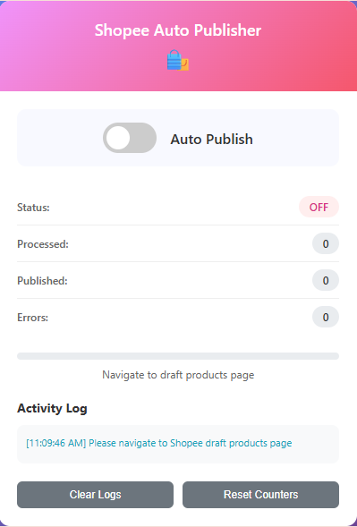

# Shopee商品自動公開ツール

Shopee Seller CenterでAPIリクエストを使用して、条件を満たす下書き商品を自動的に公開するChrome拡張機能です。



## 主な機能

- ✅ 複数ページにわたってすべての下書き商品を自動スキャン
- ✅ コンテンツ品質レベル2（適格）の商品をフィルタリング
- ✅ ShopeeのAPIを使用して適格商品を公開
- ✅ リアルタイム進捗追跡とログ記録
- ✅ トグルスイッチ付きのモダンで直感的なUI
- ✅ 包括的なエラー処理と再試行ロジック
- ✅ 統計追跡（処理済み、公開済み、エラー数）
- ✅ 視覚的な完了通知

## 必要要件

- Google Chromeブラウザ
- アクティブなShopee Sellerアカウント
- Shopee Seller Center（フィリピン）へのアクセス権

## インストール方法

### 方法1：デベロッパーモード（推奨）

1. **拡張機能ファイルのダウンロード**
   - このリポジトリからすべてのファイルをダウンロード
   - コンピュータ上のフォルダに展開

2. **Chromeでデベロッパーモードを有効化**
   - Chromeを開き、`chrome://extensions/`に移動
   - 右上の「デベロッパーモード」をオンにする

3. **拡張機能の読み込み**
   - 「パッケージ化されていない拡張機能を読み込む」ボタンをクリック
   - 拡張機能ファイルが含まれるフォルダを選択
   - 拡張機能がリストに表示されます

4. **インストールの確認**
   - ChromeツールバーでShopee Auto Publisherアイコンを確認
   - 拡張機能が使用準備完了！

### 方法2：Chrome Web Store（将来）
*この拡張機能は将来Chrome Web Storeで公開される可能性があります。*

## 使用方法

### はじめに

1. **下書き商品ページに移動**
   - [Shopee Seller Center](https://seller.shopee.ph/)にアクセス
   - `商品` > `商品リスト` > `未公開` > `下書き`に移動
   - または直接アクセス：`https://seller.shopee.ph/portal/product/list/unpublished/draft`

2. **拡張機能ポップアップを開く**
   - ツールバーのShopee Auto Publisherアイコンをクリック
   - ポップアップに現在のステータスとコントロールが表示されます

3. **自動化を開始**
   - 「自動公開」スイッチをONにする
   - 拡張機能が自動的に：
     - すべてのページの下書き商品をスキャン
     - コンテンツ品質レベル2の商品をフィルタリング
     - 各適格商品を公開
     - リアルタイムの進捗とログを表示

4. **進捗の監視**
   - 進捗バーと活動ログを確認
   - 処理済み、公開済み、エラー数の統計を表示
   - 完了時に完了通知を表示

### インターフェースの理解

#### ステータスインジケータ
- **OFF**：拡張機能が非アクティブ
- **ON**：拡張機能が実行中
- **COMPLETED**：処理完了

#### 統計情報
- **処理済み**：検査された商品の総数
- **公開済み**：正常に公開された商品数
- **エラー**：公開に失敗した試行回数

#### 活動ログ
- すべてのアクションのリアルタイムログ
- カラーコード化されたメッセージ（成功、エラー、情報）
- 最新エントリに自動スクロール

#### コントロール
- **ログクリア**：すべてのログエントリを削除
- **カウンターリセット**：統計をゼロにリセット

## 動作原理

### 自動化フロー

1. **商品の発見**
   - 各ページで`get_draft_product_list` APIを呼び出し
   - ページネーション付きですべての下書き商品を取得

2. **品質評価**
   - 商品バッチに対して`get_content_quality_info` APIを呼び出し
   - `quality_level: 2`（適格）の商品をフィルタリング

3. **商品公開**
   - 各適格商品に対して：
     - `get_product_info` APIを呼び出して詳細情報を取得
     - `create_product_info_for_draft` APIを呼び出して公開
     - 成功/エラー応答を処理

4. **進捗追跡**
   - 現在のステータスでUIを更新
   - タイムスタンプ付きですべての活動をログ
   - プロセス全体を通じて統計を維持

### 使用するAPIエンドポイント

- `GET /api/v3/mpsku/list/v2/get_draft_product_list` - 下書き商品を取得
- `GET /api/v3/mpsku/list/v2/get_content_quality_info` - 品質情報を取得
- `GET /api/v3/product/get_product_info` - 詳細商品情報を取得
- `POST /api/v3/product/create_product_info_for_draft` - 商品を公開

## 技術詳細

### アーキテクチャ
- **Manifest V3**：最新のChrome拡張機能標準
- **コンテンツスクリプト**：Shopeeページで実行、自動化を処理
- **バックグラウンドサービスワーカー**：拡張機能のライフサイクルを管理
- **ポップアップインターフェース**：ユーザーコントロールと監視

### セキュリティ
- Shopee Seller Centerドメインでのみ動作
- 既存のブラウザセッションとクッキーを使用
- 外部データ送信なし
- すべての処理がローカルで実行

### パフォーマンス
- API呼び出し間の速度制限（1秒遅延）
- 効率性のためのバッチ処理
- 大規模データセットの進捗追跡
- 優雅なエラー処理と回復

## トラブルシューティング

### よくある問題

**拡張機能が動作しない：**
- 正しいShopeeページにいることを確認
- Shopee Seller Centerにログインしていることを確認
- ページを更新して再試行

**商品が見つからない：**
- アカウントに下書き商品があることを確認
- 商品がコンテンツ品質評価を受けていることを確認
- 商品が公開対象であることを確認

**APIエラー：**
- セッションが期限切れの可能性 - 更新して再ログイン
- ネットワーク接続の問題
- Shopeeサーバーの一時的な問題

**権限エラー：**
- 拡張機能が適切な権限を持っていることを確認
- ShopeeのChromeサイト権限を確認

### ヘルプの取得

1. 拡張機能ポップアップの活動ログを確認
2. Chrome DevTools（F12）を開いてコンソールのエラーを確認
3. Shopeeアカウントが適切な権限を持っていることを確認
4. ページを更新して拡張機能を再起動

## 開発

### ファイル構造
```
shopee-extension/
├── manifest.json           # 拡張機能設定
├── popup.html             # ポップアップインターフェース
├── popup.css              # ポップアップスタイリング
├── popup.js               # ポップアップロジック
├── content.js             # メイン自動化ロジック
├── background.js          # バックグラウンドサービスワーカー
├── icons/                 # 拡張機能アイコン
└── README.md              # このファイル
```

### ローカル開発
1. ソースファイルを変更
2. `chrome://extensions/`に移動
3. 拡張機能の「再読み込み」ボタンをクリック
4. Shopee Seller Centerで変更をテスト

## バージョン履歴

### v1.0.0（現在）
- 初回リリース
- 基本的な自動化機能
- 進捗追跡付きのモダンUI
- 包括的なエラー処理

## ライセンス

このプロジェクトはMITライセンスの下で公開されています。

## 貢献

プルリクエストを歓迎します。大きな変更については、まずissueを開いて変更したいことを議論してください。

## サポート

質問や問題がある場合は、GitHubのissueを作成してください。 